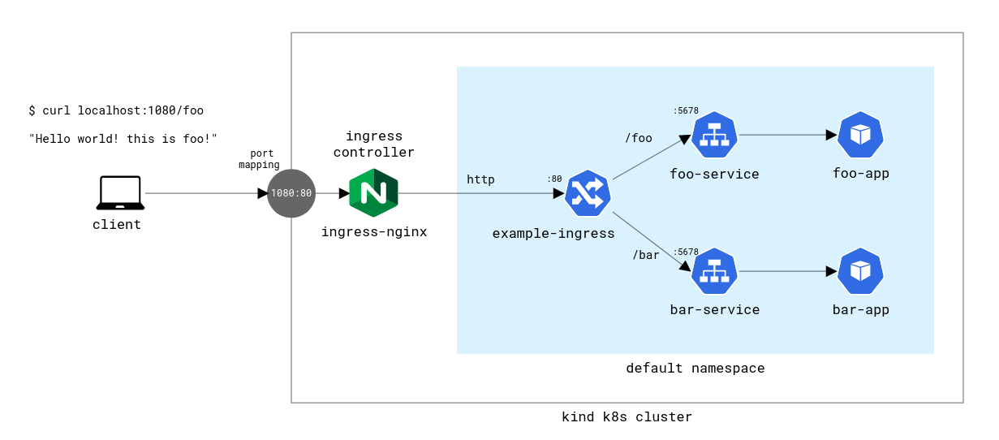

# k8s-kind-ingress-demo

Setting up an [ingress controller on a kind k8s cluster](https://kind.sigs.k8s.io/docs/user/ingress/)

> [!WARNING]
> Beginning March 2026 the [Ingress NGINX controller](https://github.com/kubernetes/ingress-nginx#ingress-nginx-retirement) is deprecated. More info [here](https://kubernetes.io/blog/2025/11/11/ingress-nginx-retirement/). If you are looking at this repo after March 2026 please see the [migration guide to Gateway API](https://gateway-api.sigs.k8s.io/guides/getting-started/migrating-from-ingress-nginx/) or see the latest [kind docs on Ingress](https://kind.sigs.k8s.io/docs/user/ingress/).



## Prerequisites

- [Docker](https://www.docker.com/) or [Podman](https://podman.io/)
  - If you're running Podman, please see [this](https://kind.sigs.k8s.io/docs/user/rootless/).
- [kind](https://kind.sigs.k8s.io/docs/user/quick-start/#installation) (Tested with v0.31.0)
- [kubectl](https://kubernetes.io/docs/tasks/tools/) (Tested with v1.35.2)

## Cluster setup

- Prepare kind cluster with port mappings:

```bash
kind create cluster --config="cluster-config.yml"
```

> Note: To support running as rootless Docker/Podman we bind http (80) to port 1080 on localhost and https (443) to port 1443 on localhost

## Usage

1. Deploy [nginx ingress controller](kind-ignress.yml) to cluster

```bash
kubectl apply -f kind-nginx-ingress.yml

kubectl wait --namespace ingress-nginx \
  --for=condition=ready pod \
  --selector=app.kubernetes.io/component=controller \
  --timeout=90s
```

2. Deploy the [example workloads](workloads.yml) (pods, services and ingress)

```bash
kubectl apply -f workloads.yml

kubectl wait \
  --for=condition=ready pod \
  --selector=workload=ingress-demo \
  --timeout=90s
```

3. Run curl against the ingress controller on the specified ports/paths

```bash
curl localhost:1080/foo

curl localhost:1080/bar
```

Output:

```bash
'hello world! this is foo!'
'hello world! this is bar!'
```

## Clean up

- Run `kubectl delete -f workloads.yml` if you want to remove the example workloads
- Run `kubectl delete -f kind-nginx-ingress.yml` if you want to remove the ingress controller
- Run `kind delete cluster` to remove the full cluster

## Acknowledgements

- This guide is based on the existing [kind](https://kind.sigs.k8s.io/) docs on [setting up a nginx ingress controller](https://kind.sigs.k8s.io/docs/user/ingress/). Some minor tweaks in k8s specs, updated to use Ingress v1 and customized to run on rootless Docker/Podman.
- Diagrams created with [cloudskew](https://github.com/cloudskew/cloudskew)
